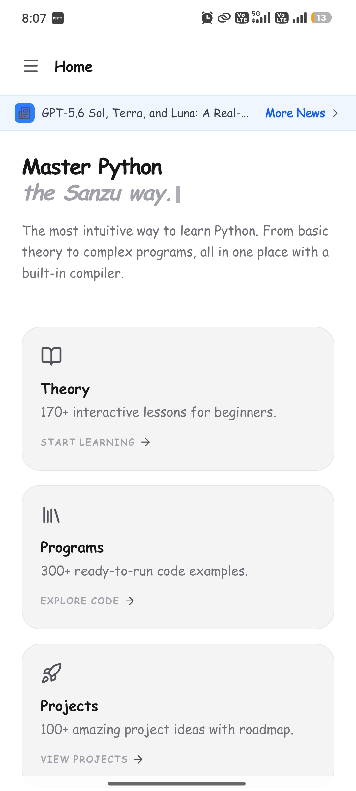
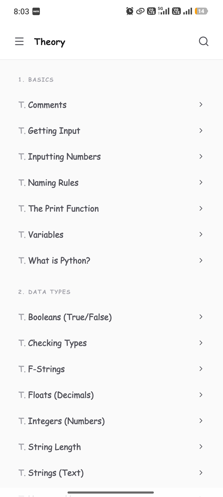
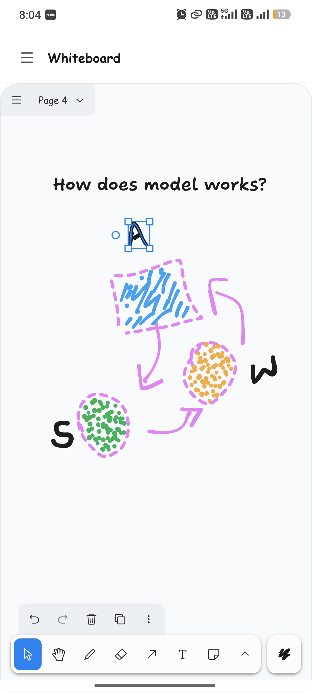

# Sanzu App
Python notes and IDE application for Android
<a href="https://github.com/heysanzu/sanzu/blob/main/README.md#download-sanzu" download>
  <button style="padding:10px 20px; background:green; color:white; border:none; border-radius:5px;">see more</button>
</a> 

  

## Download "Sanzu"
This app combines comprehensive Python notes with a built‑in compiler, so you can study and practice anywhere, without an internet connection.

  

➠ <a href="https://github.com/heysanzu/sanzu/releases/download/Sanzu_v1.1/sanzu.apk" download>
  <button style="padding:10px 20px; background:green; color:white; border:none; border-radius:5px;">Download</button>
</a>

**How to Use:**
- `Download` the appropriate version for your device.
- `Install` the app (on Android, allow installation from `unknown sources` if needed).
- `Open` the app and start exploring `Python notes` or use the `compiler`.
- Write your code in the `editor`, tap `Run`, and see the `output` instantly.

## Screenshots
Discover the sleek, user-friendly interface of Sanzu. Swipe through the application screens to see the IDE, interactive Python notes, and the built-in AI assistant in action.

*All features, including the compiler and notes, run completely offline. The Sanzu AI module provides intelligent coding suggestions and instant debugging assistance right on your Android device.*

  
  
  
  
  
  
  
  

---

## Release: Sanzu v1.1
We are excited to announce the release of Sanzu v1.1! This update introduces the brand-new Sanzu AI, major compiler speed improvements, expanded study materials, and critical stability fixes to enhance your Python coding experience.

## What's New
**Sanzu AI:** Meet your new built-in `Python assistant`. You can now ask questions, get instant explanations, and debug your code directly within the app.

Added 150+ new comprehensive topics covering advanced concepts like decorators, generators, and list comprehensions.

## Improvements
**Faster Compiler:** Code execution is now up to 2× faster, featuring significantly improved output rendering for a smoother IDE experience and Turtle graphics.

## Bug Fixes
**Startup Stability:** Resolved a critical crash that affected some `Android 12` devices during a cold start.

Full Changelog: https://github.com/heysanzu/sanzu/commits/Sanzu_v1.1

---

## Contribution & Feedback
If you enjoy Sanzu, please consider:

**Reporting Issues:** If you encounter a crash or bug, please open an issue in this repository.

**Suggesting Topics:** Have a Python concept you want to see explained in the "Notes" section? Open a Pull Request or a discussion.

## License
© 2026-27 Sanzu. All rights reserved.

Maintained by [@heysanzu](https://github.com/heysanzu)

---

  Made for beginners, by <a href="https://github.com/heysanzu">Shahnewaz Alam</a>

